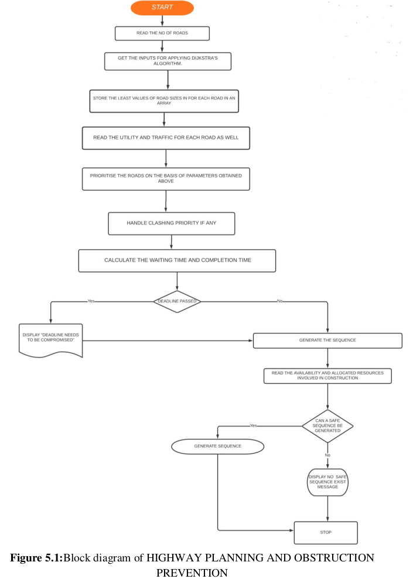

# Road Construction Using Highway Planning and Obstruction Prevention

### Table Of Contents

-  Abstract
-  Introduction
-  Project Requirements
-  Literature Survey
-  Block Diagram
-  Pseudo Code
-  Output Screentshot
-  Conclusion
-  References
-  Our Team


### 1. Abstract

The project titled ROAD CONSTRUCTION USING HIGHWAY PLANNING AND
OBSTRUCTION PREVENTION aims to address one of the major issues that the Indian
road construction department is facing. These days we notice that a large number of roads
are not in proper condition and many of them require restoration. Many of which are in
high usage and require immidiate repair. Our project aims to help athorities with
providing them the most profitable path for road contruction for a given map and the
sequence in which these roads can be addressed so that it would be convenient for both
the authorities as well as the general public.Our project collects various forms regarding
the map for the road that needs to be constructed, with this data we find the most shortest
and profitable path possible . Then we collect data for utility and traffic for all the roads
,then we normalize the data collected and generate a appropriate sequence in which the
road construction should be addressed. We have also included a deadline section so that
the roads that take more then the allocated time are highlighted and if necessary removed.
Also, a check for hindrance detection is added which can be used when we have limited
number of resources and a proper allocation of these resources is required. For this we
take inputs for resources which can refer to asphalt, machinery, mortar etc. Then we
require maximum resources needed for each road, amount of resources allotted for each
road, and available resources, based on which a safe sequence is generated that prevents
any unwanted stoppage of work.


### 2. Introduction

In countries like India where we are seeing a steep rise in the overall population there arise a
necessity of new habitat and scouring of vacant land to make new buildings, accommodations
and environments which are connected by roads. As per the statistics we get to know that a
total of 2098624 km of road was laid in India alone during the period 2001 to 2005 and these
numbers are continuously rising with each passing year. So the maintenance and construction
of new roads require a tremendous work force and attention from the government. So it
becomes necessary to design a proper algorithm that can manage the overall process of road
construction.

So the first part of the project deals with the task of getting the parameters through which a
road can be assigned a particular priority and accordingly can be used for further estimations
and calculations. So for this purpose we consider 3 parameters associated with a particular
road namely the size,utility and the traffic associated with each road . For the purpose of
getting the road size we employ yet another renowned and precise algorithm known as
djikstra algorithm to get the shortest road length

Scheduling is one of the most widely used techniques to using which any operation involving
several tasks can be ordered in such a way so that easy execution of the entire operation
becomes possible in the most efficient way possible avoiding any sort of errors and
confusions. The programme that does the task of scheduling is termed as a scheduler. Now
the scheduling used in the project involves priority scheduling without the use of pre-
emption(the reason for the same is explained in the later part of the project) ,So here the
algorithm decides how to schedule the various construction processes in the given region
based on their priorities , which in-turn is decided on the basis of various factors which are
mentioned in the above paragraph of the project. So all the constructions will be handled
accordingly.

In the second part of the proposed work, We tried to focus on the very common issue of delay
and stopping of the entire construction process due unavailability of various resources
involved in the construction process so we compared this scenario with the dead-lock
condition that arises in the operating systems while assigning resources to various running
processes and this lead us to use the same algorithm that we use in operating systems that is
the bankers algorithm for our project as well using various resources involved in the road
construction process so as to avoid any condition of an absolute deadlock state in our
construction process. The resources we use are discussed in later part of the project .So using
this bankers algorithm we make sure that at no situation should occur where for the lack of
required resources, all work gets stopped or hindered. So, the implementation of this
algorithm becomes necessary. The safe sequence advices in what order to proceed so that by
the available resources, all tasks can be completed.


### 3. Project Resource Requirement

- Software Requirements
  
    This project has been created using CODE BLOCKS
C Programming language has been used for the code

- Hardware Requirements

    Intel i3/i5/i7/i9

    Windows 7/8/8.1/10

    4 GB RAM

    4.0 GHz processor
    

### 4. Literature Survey

- 1.Title : A Comparative Review of CPU Scheduling Algorithms
AUTHORS- Mohd Shoaib and Mohd Zeeshan Farooqui
  
  - CONFERENCE PAPER Conference: Proceedings of National Conference on Recent
      Trends in Parallel Computing (RTPC - 2014)
  - At: Aligarh, India

  Published in November 2014

ADVANTAGES: CPU Scheduling decides which tasks are to be ordered in what way so
that a particular algorithm is followed to queue the processes.
DISADVANTAGES:There is no involvement of premptive SRTF in the paper , the
comparision is done only considering the non preemptive SRTF

- 2.Title : A Comparative Study of CPU Scheduling Algorithms
AUTHORS: Neetu Goel ,Dr. R.B. Garg
 
  - Journal: International Journal of Graphics & Image Processing IJGIP [ VOL-2 , Issue-
4],
  
  Published in November 2012

ADVANTAGES: This research paper shows that First Come First Serve (FCFS) &
Shortest Job First (SJF) is generally suitable for batch operating systems and Round
Robin (RR) & Priority Scheduling (PS) is suitable for time shaing systems.

DISADVANTAGES: No new algorithm was proposed in this paper

- 3.Title: Design and Implementation of Multi parameter Dijkstra’s Algorithm: A Shortest
path algorithm for real road networks.
AUTHORS: Nishtha Kesswani, Dinesh Gopalani

  - Journal: International Journal of Advances in Engineering and Research [Volume 2,
Issue 3],

  Published in september 2011

ADVANTAGES: Taking the real road networks into consideration, this paper suggests a
modification of Dijkstra's algorithm, the multi-parameter Dijkstra’s algorithm (MPD) that
considers multiple parameters into consideration. Apart from the distance between any
two nodes, it considers factors such as time taken to travel from the source to the destination, 
congestion of the route etc. so that the user can select the desired route based
on his/her preferences.

DISADVANTAGES: Cosiderable importance was not given to traffic and utility of roads

- 4.Title: Performance of deadlock avoidance algorithms in flexible manufacturing systems.
AUTHORS: Maria P. Fanti,Bruno Maione,Saverio Mascolo,Biago Turchiano

  - Journal: Journal of Manufacturing Systems(Elsevier) [Volume 15, Issue 3]

  Published in 1996

ABOUT: This paper compares performances of some deadlock avoidance policies. First,
theoretical analysis is carried out by introducing a criterion for ordering different policies by
flexibility in resource allocation. Second, avoidance policies are applied to some case
studies, which are simulated in detail. The simulation analysis confirms the theoretical
results showing that the algorithms allowing larger flexibility in resource allocation lead to
better performance indices.

- 5.Title: Approaches for Deadlock Detection and Deadlock Prevention for Distributed
Systems.
AUTHORS: Dhiraj Gupta, V.K Gupta (Department of Computer Science,NIMS
University,Jaipur,Rajasthan, India

  - Journal: Res. J. Recent Sci., Volume 1, Issue (ISC-2011)

  Published in 2011

ABOUT: This paper, discusses about deadlock detection techniques and present
approaches for detecting deadlocks in Distributed Systems. In many other aspects of
distributed systems, they are harder to detect, avoid, and prevent. Deadlocks are a
fundamental problem in distributed systems. Deadlock detection is more difficult in systems
where there is no such central agent and processes may communicate directly with one
another.
- 6.Title: A Review Study on the CPU Scheduling Algorithms.
AUTHORS: Shweta Jain(Department of Computer Science, Shri R.G.P. Gujarati
Professional Institute) , Dr. Saurabh Jain(Institute of Computer Applications, Shri Vaishnav
Vidyapeeth Vishwavidyalaya)

  - Journal: International Journal of Advanced Research in Computer and
    Communication Engineering IJARCCE [Vol. 5, Issue 8]

  Published in August 2016

ABOUT: In this paper, a review of techniques proposed by different authors are discussed
which is helpful to design Operating Systems and new researches in Scheduling. System
designers have many complex decisions that they are required to make before finalizing
their designs. The selections of the appropriate processor scheduling algorithms allow them
to tailor the design to perform at the highest level of performance, reducing overall idle
time. Design specifications will drive decisions such as responsiveness, preemption, and
reliability. These combinations can benefit both single processor and multiprocessor
systems if selected in the proper combination.

- 7.Title: Research on the optimization of Dijkstra’s Algorithm and its application.
AUTHORS: Arjun RK, Pooja Reddy, Shama, M.Yamuna

  - Journal: International Journal of Science, Technology & Management IJSTM [Vol. 4,
Issue 1]
  
  PUBLISHED IN APRIL 2015

ABOUT: This paper mainly studied the application of the shortest path algorithm based on
the data structure, and proposed the improved Dijkstra’s algorithm, which optimized
selection of the shortest path node and data storage structure and organization. Studies
showed that, compared with the traditional Dijkstra’s algorithm, the optimized Dijkstra’s
algorithm which has optimized the space complexity, time complexity and storage
combination reduced the storage space, reduced data redundancy and greatly improved the
running rate. It was clearly shown that the optimized algorithm is more applicable to
calculate the shortest path.


### 5. Block Diagram



Explanation:

1) First we take inputs for the number of roads
2) Then we will take inputs for the formation of map in form of graph for all the different
roads
3) Then based on the graph we will apply dijakstra algorithm and find the shortest distance
possible between the desired cities
4) This distance is saved as a parameter of size for the roads
5) Also the route of the shortest path will be displayed
6) Then we read the utility, traffic and deadline for all the roads
7) Based on these inputs we check for clashing between the priorities
8) If present the clashing is handled
9) Then the required sequence is generated
10) Based on the sequence we find the waiting and completion times for the roads
11) Now we check if the roads can be completed within their allocated time
12) If deadline is crossed then an error message “DEADLINE NEEDS TO BE
COMPROMISED IS DISPLAYED”
13) If dead line is not passed the generated sequence is displayed and we move to the second
part of project
14) Here we read the number of resources needed for each road,maximum resources needed
for each road, amount of resources allotted for each road, and available resources
15) Based on which a safe sequence is generated
16) If sequence is not generated then an error message is displayed


### 6. Pseudo Code

PSEUDO CODE FOR DIJAKSTRA FOR FINDING SHORTEST PATH FOR ROADS ->
INPUTS AND ALGORITHM ->

1- FIRSTLY, WE WILL TAKE THE INPUT FOR THE FORMATION OF MAP FOR
DIJAKSTRA

2- THIS INVOLVES TAKING THE INPUT FOR NUMBER OF CITIES(NODES);
NUMBER OF ROUTES CONNECTING THEM(EDGES); AND THE DISTANCE
OF THE ROUTES(WEIGHT OF EDGES)

3- THEN WE APPLY THE DIJAKSTRA ALGORITHM FOR THE MAP(GRAPH)
AS FOLLOWS

```
function Dijkstra(Graph, source)

       dist[source] := 0                              // Distance from source to source is set to 0
       
       for each vertex v in Graph:                    // Initializations
       
       if v ≠ source
             dist[v] := infinity                          // Unknown distance function from source to each node                                                                 set to infinity
        add v to Q                                     // All nodes initially in Q
        
        while Q is not empty:                          // The main loop
              v := vertex in Q with min dist[v]              // In the first run-through,this vertex is the source                                                                 node
              remove v from Q
        
        for each neighbor u of v:                      // where neighbor u has not yet been removed
                                                          from Q.
              alt := dist[v] + length(v, u)
              if alt < dist[u]:                              // A shorter path to u has been found
                    dist[u] := alt                                 // Update distance of u

return dist[]
```

4- THEN FROM THE OBTAINED DISTANCE ARRAY WE FIND THE
DESTIANTION VERTEX

5- THE DISTANCE IS THEN SAVED AS SIZE FOR THE ROAD

PSEUDO CODE FOR PRIORITY SCHEDULING FOR SCHEDULING THE ROADS
INPUTS AND ALGORITHM ->

1- FIRSTLY, WE TAKE THE INPUT FOR THE NO OF ROADS.

2- NOW HERE WE ASSIGN THE PRIORITIES FOR EACH ROAD BASED ON A
NO OF PARAMETERS NAMELY SIZE, UTILITY, TRAFFIC.

3- NOW FOR SIZE WE EMPLOY DIJKSTRA’S ALGORITHM FOR GETTING THE
LEAST POSSIBLE PATH FOR THE CONSTRUCTION OF OUR ROAD.

4- FIRST, WE GENERATE A SEQUENCE IN WHICH THE CONSTRUCTION
WORK SHOULD PROCEED. THIS SEQUENCE IS GENERATED ON THE
BASIS OF PRIORITY SCHEDULING ALGORITHM. SO, IN THIS ALGORITHM
WE USE THE ABOVE PARAMETERS AND SUM THEM UP AND NORMALISE
THEM DOWN TO 1-100 TO GET THE PRIORITY FOR ANY CONSTRUCTION
PROJRCT.

5- Which is done by using:

Priority Pi of road i = (Si / Sigma(Si)) *100

Where Si for any given road i is submission of size, utility and traffic

6- PRIORITY SCHEDULING WITHOUT PREEMPTION IS APPLIED AS
FOLLOWS

```
function Priority Scheduling(Processes,Priority,Arrival_Time,Burst_Time)
        
        Current_Time := 0                                //Current Time of the CPU
        
        while (All Processes are not executed):
               
               P:=All the processes whose Arrival_Time=<Current_Time
               
               i := index of the process with highest Priority in P
               
               If(No index is found)                            //CPU in ideal state , no process arrived yet
               
               Current_Time++
        
        Else
               
               Execute the process P[i]
               
               Current_Time=Current_Time+Burst_Time[i]
               
               Completion_Time[i] = Current_Time
               
               Turnaround_Time[i] =Completion_Time[i] - Arrival_Time[i]
               
               waiting_time[i] = turnaround_time[i]- burst_time[i]
               
               response_time[i] = start_time[i] - arrival_time[i]

```

7- ALSO FOR THE ABOVE CASE IF A SCENARIO OCCURS WHERE THE
PRIORITIES OF TWO ROAD CLASHES THEN FIRST WE GO FOR THE
UTILITY OF THE ROADS TO DECIDE THE PRIORITY THEN TRAFFIC AND
THEN SIZE.

8- SO ONCE WE HAVE GIVEN ALL THE REQUIRED INPUTS FOR
PARAMETERS , WE WILL ALSO BE ASKING THE USER TO ENTER THE
DEADLINE AS WELL AS THE EXPECTED COMPLETION TIME.
OUTPUTS OBTAINED ->

9- SO, AFTER SUCCESSFUL EXECUTION WE WILL BE GETTING THE
WAITING TIME AS WELL AS THE TOTAL TIME CORRESPONDING TO
EACH OF THE CONSTRUCTION PROCESSES.

10- IN ADDITION TO THAT WE WILL BE GETTING THE TURNAROUND TIMES
FOR EACH CONSTRUCTION AS WELL.

PSEUDO CODE FOR BANKERS ALGORITHM ->

1- SO, THIS ALGORITHM IS USED TO GIVE A SAFE SEQUENCE FOR THE
CONTINUATION OF CONSTRUCTION PROCESSES AT ALL TIMES.

2- WE TAKE THE INPUT OF
   - NO OF RESOURCES THAT ARE REQUIRED FOR THE CONSTRUCTION
     OF THE ROAD
   - THE ALLOCATION OF THESE RESOURCES THAT THE CONSTRUCTION
     AUTHORITY HAS DONE.
   - THE MAXIMUM RESOURCES THAT A PARTICULAR ROAD WILL
     REQUIRE AT ANY STAGE IN THE CONSTRUCTION PROCESS.
   - AND LASTLY THE AVAILABILITY OF THESE RESOURCES WITH THE
     CONSTRUCTION RESOURCES CURRENTLY.

3- AFTER ALL THESE INPUTS THE STANDARD NEED MATRIX OF THE
BANKERS ALGORITHM IS CALCULATED.

4- NOW FOR EACH PROJECT WE COMPARE WHETHER THE ALLOCATION IS
GREATER OR EQUAL TO THE NEED ARRAY FIGURES FOR THE
FOLLOWING PROJECT IN CASE SUCH A PROJECT IS FOUND WE PROCESS
IT AND THEN TAKES BACK THE ALLOCATED RESOURCES FROM THAT
PARTICULAR PROJECT AND GIVES IT TO THE AVAILABLE ARRAY .

5- THE SAME PROCESS IS REPEATED UNTILL WE DON’T SATISFY THE NEED
OF EACH PROJECT.

6- IN CASE WE FAIL TO FIND A PROCESS AT ANY PARTICULAR STAGE
SUCH THAT THE NEED OF NO PROCESS IS SATISFIED BY THE
AVAILABLE MATRIX WE PRINT “ NO SAFE SEQUENCE FOR
CONSTRUCTION WITH THE AVAILABLE NO OF RESOURCES”.

7- OTHER WISE WE PRINT THE SEQUENCE WHICH NEEDS TO BE FOLLOWED
FOR SAFE COMPLETION OF ALL PROJECTS.


### 7. Output Screenshots

OUTPUT-1 (Deadline compromised,Clash of priority,Safe sequence exists)
